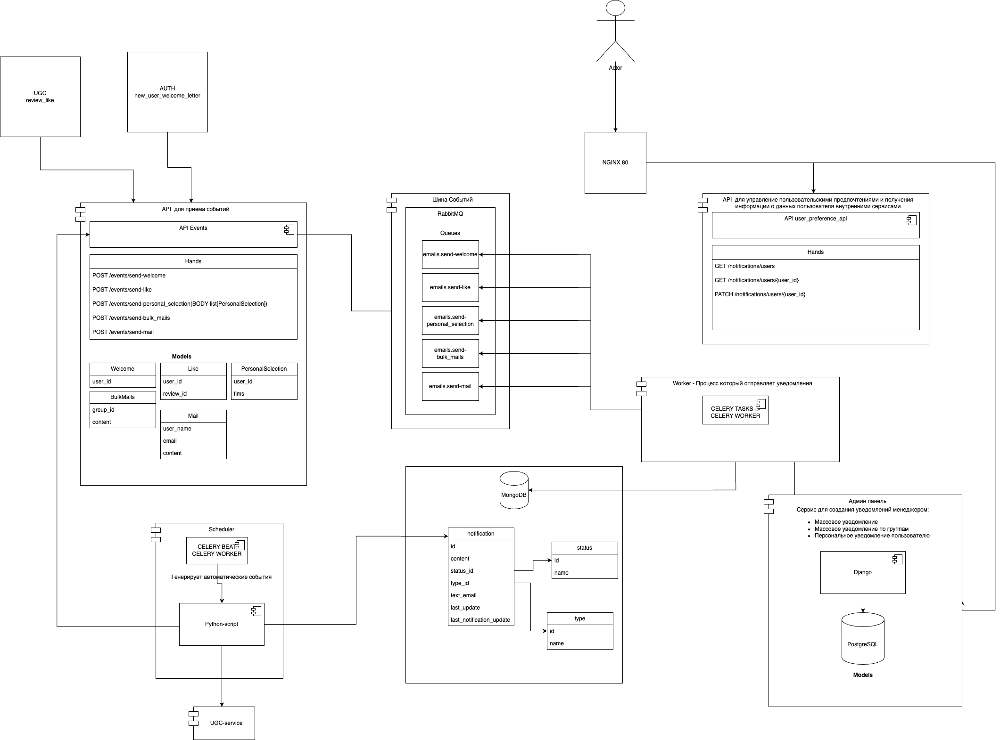

Ссылка на репозиторий: https://github.com/montekrist0/ugc_sprint_2

# UGC-спринт 2

## Авторы проекта

1. Artur Kukobin (@arkuk)
2. Boris Vladimirov (@paqquete)
3. Bogdanov Igor (@montekrist0) - TL

## 1 Назначение модуля:

Данный модуль является частью проекта "Онлайн-кинотеатр", в которой представлена реализация сервиса нотификаций пользователя.

---

## Архитектура

## 2 Используемые технологии сервиса

Технологический стек проекта:

1. [Nginx](https://www.nginx.com/) — веб-сервер;
2. MongoDB - документоориентированная БД
3. Django, FastAPI — веб-фреймворки для создания веб-приложений
4. GitHub Actions для реализации CI
5. Rabbit MQ - брокер сообщений
6. PostgreSQL - БД
7. Celery - планировщик, генератор задач 

Каждый модуль (сервис) запускается с помощью [Docker](https://www.docker.com/) контейнеров, тем самым реализуя в проекте
микросервисную архитектуру. Сервисы связаны между собой с помощью `docker compose`.

---

## 3 Запуск проекта

В проекте предусмотрен Makefile для удобства запуска проекта.

Для запуска проекта достаточно:
1. Убедиться, что в корне репозитория имеется файл `.env` с введенными параметрами по примеру `.env.example`;
2. Выполнить команду `make up`, находясь в корне репозитория

___
## 4 Описание API

Пользователь может управлять своими предпочтениями по рассылке по следующему адресу:
GET/PATCH `http://localhost:80/api/v1/notifications/users/{user_id}`

---

